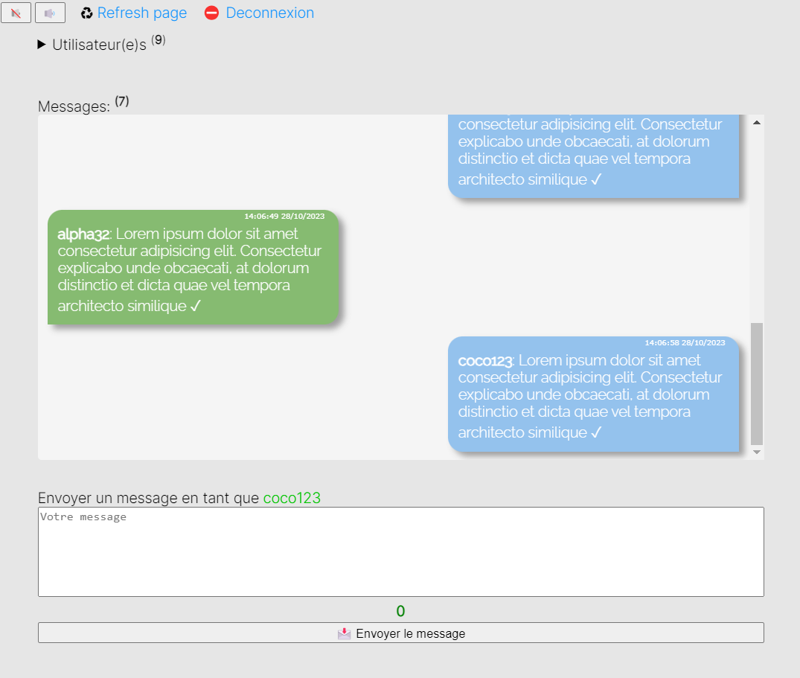

# Simple chat
- A very simple instant chat system with SQL, PHP, JS and JQuery
- Version : 2.0

### Librairies
- Jquery 3.7.1

### Dependencies
- PHP >= 8.0
- composer
- MySQL | MariaDB

### Installation
> composer install
- Import DB from "doc/"

### Run server
- bin/server.bat

### Informations
```php

// Add a user into DB
$userModel = new App\Model\UserModel();
$userModel->addUser(string $username, string $plainPassword); 

// Remove all messages into "chat" table
$chatModel = new App\Model\ChatModel():
$chatModel->deleteAllMessage(true);

```
- Parameters of DB into "db/Database.php"


## Preview

### Login


### Chat


